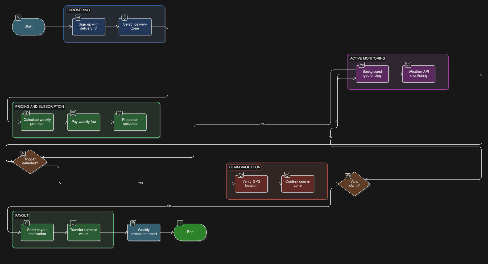
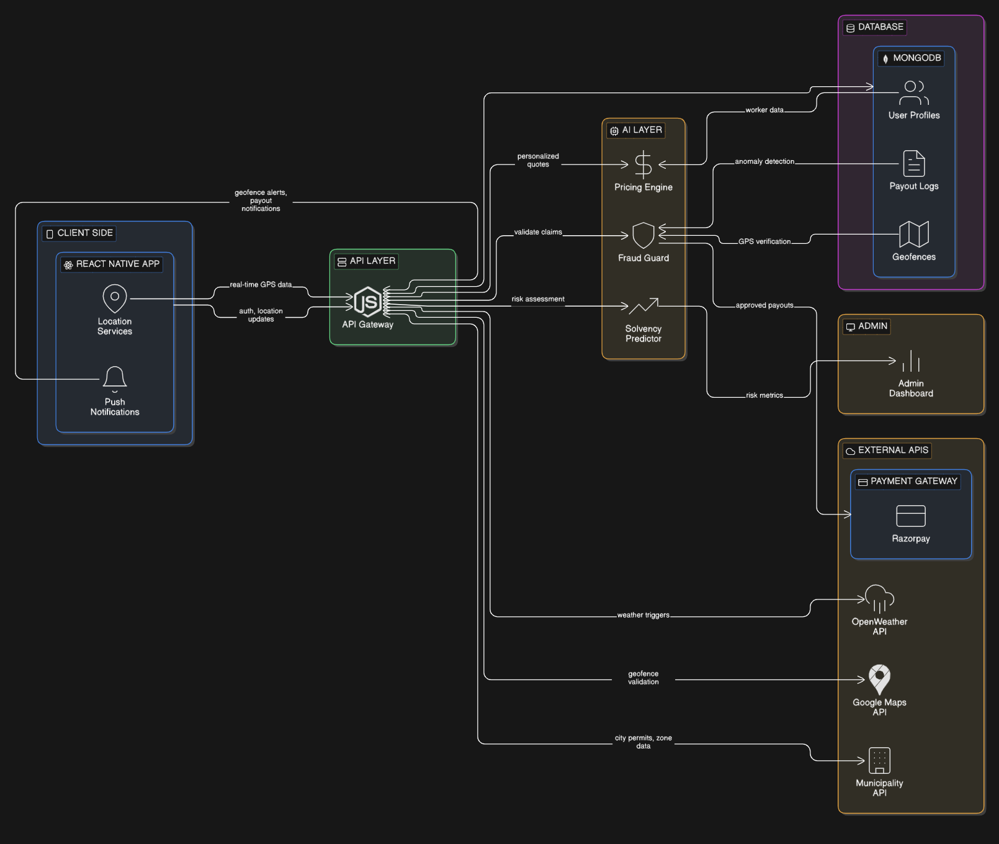

# 🚀 GIGLife

### AI-Powered Parametric Insurance for India’s Gig Economy

---

## 📌 Overview

**GIGLife** is an AI-powered parametric insurance platform designed to protect gig workers from income loss caused by external disruptions such as weather events, environmental crises, and social unrest.

Unlike traditional insurance, GIGLife uses **automated triggers and instant payouts** — eliminating manual claims and ensuring financial stability for delivery partners.

---

## 🎯 Target Users

### 👤 Persona: Food Delivery Partners (Zomato / Swiggy)

* **Example User:** Kaushik, 24, Bangalore
* **Problem:** Loses 20–30% of weekly earnings due to rain, floods, or strikes

---

## 🌍 Real-World Scenarios

### 🌧️ Environmental Disruption

* Rainfall exceeds **30mm/hour**
* Delivery zones become inaccessible
* ✅ **Automatic payout triggered**

### 🚫 Social Disruption

* Sudden strike shuts down restaurants
* Zone closure detected via APIs
* ✅ **Compensation issued**

---

## ⚙️ Parametric Insurance Model

### 💰 Weekly Premium Model

* Premiums recalculated every Sunday
* Based on:

  * Weather forecasts
  * Worker’s operating zone

### 🤝 Subsidized Plans

* Special “Safety Net” tiers
* For female & disabled workers

---

## 🧪 Pricing Logic (AI Model Engine)

Our AI calculates a **personalized weekly premium** using:

$$P_w = (B \times Z_r \times W_f) - (L_d + S_s)$$

### Variables:

* **B** → Base Tier Rate (Silver / Gold / Diamond)
* **Zr** → Zone Risk Multiplier (historical disruption data)
* **Wf** → Weather Forecast Coefficient
* **Ld** → Loyalty Discount (Safe Rider history)
* **Ss** → Social Subsidy (15% reduction)

> 🎯 This ensures **fair, dynamic, and personalized pricing**

---

## 📊 Parametric Triggers

| Trigger Type    | Condition     |
| --------------- | ------------- |
| 🌧️ Rainfall    | > 30mm/hour   |
| 🌡️ Temperature | > 42°C        |
| 🏙️ Zone Access | > 60% closure |

---

## 🛡️ Protection Plans

| Feature    | Silver | Gold        | Diamond     |
| ---------- | ------ | ----------- | ----------- |
| Income     | 50%    | 80%         | 100%        |
| Weather    | Rain   | All Weather | All Factors |
| Social     | ❌      | Partial     | Full        |
| App Outage | ❌      | ❌           | ✅           |

---

## 📱 Platform Choice

**React Native Mobile App**

* 📍 GPS tracking (fraud prevention)
* 🔔 Push notifications
* 🔋 Background efficiency

---

## 🔄 User Flow 

**Flow:**

1. User subscribes to plan
2. App tracks location & activity
3. External APIs monitor disruptions
4. Trigger condition met
5. AI validates (fraud check)
6. 💸 Instant payout

---

## 🏗️ System Architecture 

**Components:**

* Mobile App (React Native)
* Backend API (Node.js)
* AI Engine (Pricing + Fraud + Risk)
* External APIs (Weather, Maps, RSS)
* Payment Gateway

---

## 🤖 AI / ML System

| Component | Type | Purpose | Inputs | Output | Action |
| --- | --- | --- | --- | --- | --- |
| **Dynamic Pricing Engine** | Regression Model | Calculate weekly premium | Weather forecast, Zone risk score, Worker history | Personalized premium | Apply to subscription |
| **Fraud Guard** | Anomaly Detection | Detect fraud & GPS spoofing | Transaction patterns, GPS coordinates | Fraud Score (0–1) | Block payout if > 0.8 |
| **Risk Modeling** | Time-Series Forecasting | Predict claim volume | Historical claims, Weather trends | Estimated loss ratio | Adjust reserves |

---

## 💻 Tech Stack

* **Frontend:** React Native
* **Backend:** Node.js + Express
* **Database:** MongoDB

### Integrations

* Weather API (OpenWeather)
* Google Maps (Geofencing)
* Razorpay (Payments - Sandbox)
* Municipality RSS Feeds (Mock)

---

## 🌟 Key Differentiators

* ⚡ Zero-touch payouts
* 🧠 AI-driven pricing + fraud + risk
* 📆 Weekly income alignment
* 🤝 Social equity subsidies
* 📱 Mobile-first architecture

---

## 🛣️ Development Roadmap

### Phase 1: Seed (March 4 – March 20)

* Persona research
* AI architecture design
* Idea validation & documentation

## 🏁 Future Scope

* Expand to ride-sharing & logistics
* Real-time adaptive pricing
* Platform partnerships (Zomato, Swiggy)

---

## 💡 Vision

To become the **financial safety layer for gig workers**, ensuring stable income in an unpredictable world.

---
